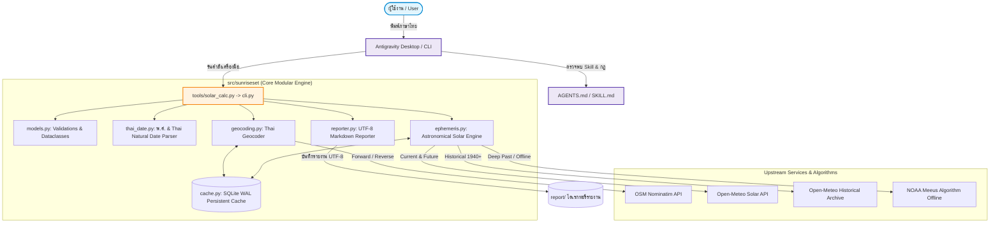

# 📘 เอกสารเชิงเทคนิคเพื่อการศึกษา (Technical Architecture & Engineering Overview)
### โครงการ SunRiseSet — Production-Grade AI Agent Harness

เอกสารนี้จัดทำขึ้นเพื่ออธิบายหลักการทำงานเชิงลึก สถาปัตยกรรมซอฟต์แวร์ อัลกอริทึมทางดาราศาสตร์ และเทคนิคทางวิศวกรรมของระบบ **SunRiseSet** เพื่อใช้เป็นกรณีศึกษาสำหรับนักพัฒนา วิศวกร AI และผู้ที่สนใจสร้าง **AI-Native Agent Harness**

---

## 📑 สารบัญ (Table of Contents)

1. [สถาปัตยกรรมระบบภาพรวม (System Architecture & Layered Design)](#1-สถาปัตยกรรมระบบภาพรวม-system-architecture--layered-design)
2. [กลไกการคำนวณดาราศาสตร์สุริยะ (Solar Ephemeris Engine)](#2-กลไกการคำนวณดาราศาสตร์สุริยะ-solar-ephemeris-engine)
   - [2.1 ยุทธศาสตร์แบบ 2 ระดับ (Two-Tier Ephemeris Strategy)](#21-ยุทธศาสตร์แบบ-2-ระดับ-two-tier-ephemeris-strategy)
   - [2.2 คณิตศาสตร์เบื้องหลังอัลกอริทึมดาราศาสตร์ NOAA / Jean Meeus](#22-คณิตศาสตร์เบื้องหลังอัลกอริทึมดาราศาสตร์-noaa--jean-meeus)
   - [2.3 การคำนวณวันในอดีต (Historical Archive API vs NOAA Offline)](#23-การคำนวณวันในอดีต-historical-archive-api-vs-noaa-offline)
3. [ระบบระบุพิกัดและลำดับชั้นการปกครองของไทย (Thai Geocoding Hierarchy)](#3-ระบบระบุพิกัดและลำดับชั้นการปกครองของไทย-thai-geocoding-hierarchy)
   - [3.1 การแปลงที่อยู่ 2 ทาง (Forward & Reverse Geocoding)](#31-การแปลงที่อยู่-2-ทาง-forward--reverse-geocoding)
   - [3.2 การทำ Mapping โครงสร้างการปกครองไทยจาก OpenStreetMap](#32-การทำ-mapping-โครงสร้างการปกครองไทยจาก-openstreetmap)
4. [ระบบประมวลผลปฏิทินพุทธศักราชและภาษาไทยธรรมชาติ (Thai Date Processing)](#4-ระบบประมวลผลปฏิทินพุทธศักราชและภาษาไทยธรรมชาติ-thai-date-processing)
   - [4.1 ตรรกะการแปลงปี พ.ศ. สู่ ค.ศ.](#41-ตรรกะการแปลงปี-พศ-สู่-คศ)
   - [4.2 Regular Expressions สำหรับภาษาไทยธรรมชาติ](#42-regular-expressions-สำหรับภาษาไทยธรรมชาติ)
   - [4.3 การจัดการปีอธิกสุรทิน (Leap Year) ในปฏิทินไทย](#43-การจัดการปีอธิกสุรทิน-leap-year-ในปฏิทินไทย)
5. [ระบบจัดการหน่วยความจำแคชความเร็วสูง (High-Performance SQLite Caching)](#5-ระบบจัดการหน่วยความจำแคชความเร็วสูง-high-performance-sqlite-caching)
   - [5.1 การออกแบบโครงสร้างฐานข้อมูล SQLite WAL Mode](#51-การออกแบบโครงสร้างฐานข้อมูล-sqlite-wal-mode)
   - [5.2 การสร้าง Cache Key และ Time-To-Live (TTL)](#52-การสร้าง-cache-key-และ-time-to-live-ttl)
6. [ระบบสร้างรายงานภาษาไทยและความเข้ากันได้ข้าม OS (Cross-Platform UTF-8 Reporting)](#6-ระบบสร้างรายงานภาษาไทยและความเข้ากันได้ข้าม-os-cross-platform-utf-8-reporting)
   - [6.1 การทำ Filename Sanitization บน Windows Filesystem](#61-การทำ-filename-sanitization-บน-windows-filesystem)
   - [6.2 การรับประกัน UTF-8 และการจัดการ Path ด้วย POSIX Standard](#62-การรับประกัน-utf-8-และการจัดการ-path-ด้วย-posix-standard)
7. [การออกแบบ AI-Native CLI Envelope และ Error Taxonomy](#7-การออกแบบ-ai-native-cli-envelope-และ-error-taxonomy)
   - [7.1 Standard JSON Envelope Specification](#71-standard-json-envelope-specification)
   - [7.2 มาตรฐาน Exit Codes สำหรับ AI Agent](#72-มาตรฐาน-exit-codes-สำหรับ-ai-agent)
8. [แนวทางการศึกษาและพัฒนาต่อยอด (Future Work & Extensions)](#8-แนวทางการศึกษาและพัฒนาต่อยอด-future-work--extensions)

---

## 1. สถาปัตยกรรมระบบภาพรวม (System Architecture & Layered Design)

โปรเจกต์ SunRiseSet ได้รับการออกแบบตามรูปแบบ **AI-Native Layered Architecture** เพื่อแยกชั้นความรับผิดชอบ (Separation of Concerns) อย่างชัดเจน:



### การแบ่งชั้นโมดูล (Module Layers):
- **Presentation Layer**: หน้าต่างสนทนา Antigravity Chat หรือ Command Line Interface พร้อมตัวเลือก `--human` และ Default JSON Envelope
- **Orchestration Layer (`cli.py`, `tools/solar_calc.py`)**: ตรวจสอบอินพุต, แปลงวันที่ พ.ศ., ประสานการทำงานระหว่างโมดูล Geocoding และ Ephemeris, สั่งบันทึกรายงาน และจัดการ Exit Code
- **Domain Logic Layer (`ephemeris.py`, `geocoding.py`, `thai_date.py`)**: คำนวณดาราศาสตร์, จัดหมวดหมู่ที่อยู่ไทย, และแปลงปฏิทิน
- **Infrastructure Layer (`cache.py`, `reporter.py`)**: ฐานข้อมูล SQLite WAL สำหรับแคช และ I/O เขียนไฟล์รายงาน UTF-8

---

## 2. กลไกการคำนวณดาราศาสตร์สุริยะ (Solar Ephemeris Engine)

### 2.1 ยุทธศาสตร์แบบ 2 ระดับ (Two-Tier Ephemeris Strategy)

เพื่อให้ระบบมีความแม่นยำสูงสุดในสถานการณ์ปกติ และสามารถทำงานต่อได้ 100% แม้ไม่มีอินเทอร์เน็ตหรือเครือข่ายขัดข้อง จึงใช้สถาปัตยกรรม **Hybrid Ephemeris**:

```text
[คำขอคำนวณพิกัดและวันที่]
        │
        ▼
   ตรวจสอบแคช SQLite?
   ├── พบในแคช  ──> คืนผลลัพธ์ทันที (< 20ms)
   └── ไม่พบในแคช
        │
        ▼
   วันที่ย้อนหลังก่อนปี 1940 (พ.ศ. 2483)?
   ├── ใช่ ───────> เรียกใช้ NOAA Meeus Algorithm (Offline Formula)
   └── ไม่ใช่
        │
        ▼
   เรียกใช้ Open-Meteo API (Online)
   ├── สำเร็จ ────> บันทึกแคชและคืนผลลัพธ์
   └── ล้มเหลว ───> Fallback เข้าสู่ NOAA Meeus Algorithm (Offline) ทันที
```

### 2.2 คณิตศาสตร์เบื้องหลังอัลกอริทึมดาราศาสตร์ NOAA / Jean Meeus

อัลกอริทึมออฟไลน์ใน [`ephemeris.py`](src/sunriseset/ephemeris.py) พัฒนาขึ้นโดยอ้างอิงหลักการคำนวณของ **NOAA (National Oceanic and Atmospheric Administration)** และหนังสือ *Astronomical Algorithms* ของ **Jean Meeus**:

1. **การคำนวณวันจูเลียน (Julian Day - $JD$)**:
   แปลงปี ($Y$), เดือน ($M$), วัน ($D$) ของศักราชเกรกอเรียนเป็นวันจูเลียน:
   $$JD = \lfloor 365.25(Y + 4716) \rfloor + \lfloor 30.6001(M + 1) \rfloor + D + B - 1524.5$$
   เมื่อ $B = 2 - A + \lfloor A/4 \rfloor$ และ $A = \lfloor Y/100 \rfloor$

2. **ศตวรรษจูเลียน (Julian Century - $T$)**:
   คำนวณนับจากจุดอ้างอิงยุค J2000.0 (1 มกราคม 2000 เที่ยงวัน):
   $$T = \frac{JD - 2451545.0}{36525}$$

3. **ลองจิจูดเฉลี่ยของดวงอาทิตย์ (Geometric Mean Longitude - $L_0$)**:
   $$L_0 = 280.46646 + 36000.76983 \cdot T + 0.0003032 \cdot T^2 \pmod{360^\circ}$$

4. **ความผิดปกติเฉลี่ยของดวงอาทิตย์ (Mean Anomaly - $M$)**:
   $$M = 357.52911 + 35999.05029 \cdot T - 0.0001537 \cdot T^2$$

5. **สมการจุดศูนย์กลาง (Equation of Center - $C$)**:
   $$C = (1.914602 - 0.004817 \cdot T) \sin(M) + (0.019993 - 0.000101 \cdot T) \sin(2M) + 0.000289 \sin(3M)$$

6. **ลองจิจูดจริง ($\odot$) และลองจิจูดปรากฏ ($\lambda$)**:
   $$\odot = L_0 + C$$
   $$\lambda = \odot - 0.00569 - 0.00478 \sin(125.04 - 1934.136 \cdot T)$$

7. **ความเอียงเฉลี่ยของสุริยวิถี (Obliquity of the Ecliptic - $\epsilon$)**:
   $$\epsilon_0 = 23^\circ 26' 21.448'' - 46.8150'' \cdot T - 0.00059'' \cdot T^2 + 0.001813'' \cdot T^3$$
   $$\epsilon = \epsilon_0 + 0.00256 \cos(125.04 - 1934.136 \cdot T)$$

8. **เดคลิเนชันของดวงอาทิตย์ (Solar Declination - $\delta$)**:
   $$\sin(\delta) = \sin(\epsilon) \sin(\lambda)$$

9. **สมการเวลา (Equation of Time - $EoT$ ในหน่วยนาที)**:
   คำนวณความแตกต่างระหว่างเวลาสุริยะจริง (Apparent Solar Time) กับเวลาสุริยะเฉลี่ย (Mean Solar Time):
   $$y = \tan^2(\epsilon / 2)$$
   $$EoT = 4 \cdot [y \sin(2L_0) - 2e \sin(M) + 4e y \sin(M) \cos(2L_0) - 0.5 y^2 \sin(4L_0) - 1.25 e^2 \sin(2M)]$$

10. **มุมชั่วโมงของพระอาทิตย์ขึ้น/ตก (Hour Angle - $HA$)**:
    กำหนดมุมเงยขอบฟ้ามาตรฐาน $Zenith = 90.833^\circ$ (รวมผลการหักเหของแสงในบรรยากาศ $34'$ และรัศมีปรากฏของขอบดวงอาทิตย์ $16'$):
    $$\cos(HA) = \frac{\cos(90.833^\circ) - \sin(\phi) \sin(\delta)}{\cos(\phi) \cos(\delta)}$$
    เมื่อ $\phi$ คือละติจูดของตำแหน่งสังเกตการณ์

11. **การคำนวณเวลาท้องถิ่น**:
    $$Solar Noon (UTC) = \frac{720 - 4 \cdot Longitude - EoT}{1440} \times 24$$
    $$Sunrise (UTC) = Solar Noon - \frac{HA \cdot 4}{60}$$
    $$Sunset (UTC) = Solar Noon + \frac{HA \cdot 4}{60}$$
    นำเวลา UTC ที่ได้มาปรับด้วย GMT Offset ประจำพื้นที่ (เช่น $+7$ ชม. สำหรับไทย) จะได้เวลาท้องถิ่นที่แม่นยำ

### 2.3 การคำนวณวันในอดีต (Historical Archive API vs NOAA Offline)
- **Open-Meteo Historical Weather Archive**: มีข้อมูลสถานีตรวจวัดและแบบจำลองสภาพอากาศย้อนหลังตั้งแต่ปี ค.ศ. 1940 (พ.ศ. 2483) เป็นต้นมา
- **NOAA Offline Fallback**: สำหรับวันที่ก่อนปี 1940 (เช่น วันสถาปนากรุงเทพฯ 21 เมษายน พ.ศ. 2325) อัลกอริทึม NOAA Meeus สามารถคำนวณตำแหน่งย้อนหลังไปได้หลายพันปีอย่างต่อเนื่อง

---

## 3. ระบบระบุพิกัดและลำดับชั้นการปกครองของไทย (Thai Geocoding Hierarchy)

### 3.1 การแปลงที่อยู่ 2 ทาง (Forward & Reverse Geocoding)
โมดูล [`geocoding.py`](src/sunriseset/geocoding.py) ให้บริการการแปลงพิกัดและที่อยู่ผ่าน OpenStreetMap Nominatim API:
- **Reverse Geocoding**: ป้อน `lat, lon` ➔ ได้ข้อมูลโครงสร้างที่อยู่ภาษาไทย (`AddressInfo`)
- **Forward Geocoding**: ป้อนข้อความสถานที่ภาษาไทย เช่น `"เสาชิงช้า พระนคร"` ➔ ได้พิกัด `lat, lon` และ `AddressInfo`

### 3.2 การทำ Mapping โครงสร้างการปกครองไทยจาก OpenStreetMap
เนื่องจากโครงสร้าง Address ของ OpenStreetMap ถูกออกแบบตามมาตรฐานสากล (Global Schema) โมดูลนี้จึงออกแบบตรรกะการแปลงแท็กให้ตรงกับเขตการปกครองของไทยอย่างละเอียด:

| ระดับเขตการปกครองไทย | แท็ก OSM Nominatim ที่ระบบนำมาจับคู่ (Fallback Cascades) |
| :--- | :--- |
| **ถนน (Road)** | `road`, `pedestrian`, `street`, `highway`, `footway`, `path` |
| **ตำบล / แขวง (Subdistrict)** | `subdistrict`, `quarter`, `neighbourhood`, `suburb`, `village`, `hamlet` |
| **อำเภอ / เขต (District)** | `city_district`, `district`, `county`, `municipality`, `city` |
| **จังหวัด (Province)** | `province`, `state`, `region` |
| **รหัสไปรษณีย์ (Postcode)** | `postcode` |
| **ประเทศ (Country)** | `country` |

**การจัดการคำนำหน้า (Prefix Normalization):**
ระบบมีตัวตัดและเสริมคำนำหน้า (เช่น "ตำบล", "แขวง", "อำเภอ", "เขต", "จังหวัด") เพื่อให้ชื่อที่ดึงมามีความสม่ำเสมอเมื่อนำไปแสดงผลหรือใช้ตั้งชื่อไฟล์

---

## 4. ระบบประมวลผลปฏิทินพุทธศักราชและภาษาไทยธรรมชาติ (Thai Date Processing)

โมดูล [`thai_date.py`](src/sunriseset/thai_date.py) ทำหน้าที่เป็นตัวแปลงปฏิทินอัจฉริยะ (Bilingual Calendar Engine)

### 4.1 ตรรกะการแปลงปี พ.ศ. สู่ ค.ศ.
เนื่องจากศักราชพุทธศักราชนำหน้าคริสต์ศักราชอยู่ 543 ปี ($CE = BE - 543$)
ระบบใช้เกณฑ์กำหนดช่วง (Heuristic Threshold):
- หากตัวเลขปี $\ge 2400$: ระบบจะระบุว่าเป็น **พุทธศักราช (พ.ศ.)** เสมอ และแปลงเป็น $CE = BE - 543$
- หากตัวเลขปี $< 2400$: ระบบจะถือว่าเป็น **คริสต์ศักราช (ค.ศ.)** ยกเว้นกรณีที่มีคำนำหน้า `"พ.ศ."` กำกับไว้อย่างชัดเจน

### 4.2 Regular Expressions สำหรับภาษาไทยธรรมชาติ
ระบบรองรับข้อความภาษาไทยหลากหลายรูปแบบด้วย Regular Expression:

```python
# รองรับชื่อเดือนเต็มและเดือนย่อภาษาไทย ควบคู่กับคำนำหน้า พ.ศ. / ค.ศ.
thai_pattern = re.compile(
    r'(\d{1,2})\s+([ก-๙\.]+)\s+(?:(?:พ\.?ศ\.?|ค\.?ศ\.?|ปี)\s*)?(\d{4})'
)
```

**พจนานุกรมชื่อเดือนภาษาไทย:**
- `THAI_MONTHS_FULL`: รองรับตั้งแต่ "มกราคม" (1) ถึง "ธันวาคม" (12)
- `THAI_MONTHS_ABBR`: รองรับทั้งแบบมีจุดและไม่มีจุด เช่น "ม.ค.", "ม.ค", "ก.พ.", "ก.ย.", "ธ.ค."

### 4.3 การจัดการปีอธิกสุรทิน (Leap Year) ในปฏิทินไทย
ปีอธิกสุรทินในปฏิทินไทยจะตรงกับปีที่เดือนกุมภาพันธ์มี 29 วัน ระบบจะแปลงปี พ.ศ. ให้เป็นปี ค.ศ. ดาราศาสตร์ก่อน แล้วจึงตรวจสอบเงื่อนไขเกรกอเรียน:
$$\text{is\_leap} = (\text{year} \pmod 4 == 0 \land \text{year} \pmod{100} \neq 0) \lor (\text{year} \pmod{400} == 0)$$
ทำให้ข้อความอย่าง `"29 ก.พ. 2567"` (ซึ่งตรงกับ ค.ศ. 2024) สามารถประมวลผลได้อย่างแม่นยำ ไม่เกิด Error วันที่ผิดพลาด

---

## 5. ระบบจัดการหน่วยความจำแคชความเร็วสูง (High-Performance SQLite Caching)

ในระดับ Production การเรียก API ภายนอกซ้ำซ้อนจะทำให้เกิด Latency และเสี่ยงต่อการติด Rate Limit (HTTP 429) โมดูล [`cache.py`](src/sunriseset/cache.py) จึงออกแบบระบบแคชในระดับฐานข้อมูลภายในเครื่อง:

### 5.1 การออกแบบโครงสร้างฐานข้อมูล SQLite WAL Mode
- **WAL Mode (Write-Ahead Logging)**: อนุญาตให้อ่านข้อมูลพร้อมกันได้หลายเธรด (Concurrent Readers) โดยไม่ถูกบล็อกจากการเขียน
- **Persistent Location**: เก็บไฟล์ฐานข้อมูลไว้ที่ `.cache/sunriseset.db` ภายใต้โฮมไดเรกทอรีของผู้ใช้หรือโปรเจกต์
- **Schema**:
  ```sql
  CREATE TABLE IF NOT EXISTS api_cache (
      cache_key TEXT PRIMARY KEY,
      data_json TEXT NOT NULL,
      created_at REAL NOT NULL,
      expires_at REAL NOT NULL
  );
  ```

### 5.2 การสร้าง Cache Key และ Time-To-Live (TTL)
- **Geocoding Key**: ใช้การ Normalize ข้อความสถานที่ หรือปัดเศษทศนิยมพิกัด 4 ตำแหน่ง (~11 เมตร) เช่น `geo:rev:13.7563:100.5018` มี TTL ยาวนาน (เช่น 30 วัน) เนื่องจากที่อยู่ทางภูมิศาสตร์ไม่เปลี่ยนแปลงบ่อย
- **Ephemeris Key**: ใช้คู่พิกัดและวันที่ เช่น `ephem:13.7563:100.5018:2026-09-04` มี TTL 7 วัน
- **ผลลัพธ์ Benchmark**: เมื่อค้นหาข้อมูลที่มีในแคช เวลาตอบสนองจะลดลงจาก ~500ms เหลือเพียง **< 20ms**

---

## 6. ระบบสร้างรายงานภาษาไทยและความเข้ากันได้ข้าม OS (Cross-Platform UTF-8 Reporting)

โมดูล [`reporter.py`](src/sunriseset/reporter.py) ได้รับการออกแบบให้ทำงานได้อย่างมีเสถียรภาพบนทั้ง Windows, macOS และ Linux:

### 6.1 การทำ Filename Sanitization บน Windows Filesystem
Windows มีข้อจำกัดเรื่องอักขระต้องห้ามในชื่อไฟล์ (`< > : " / \ | ? *`) ในขณะที่อักขระภาษาไทย (Unicode) สามารถใช้เป็นชื่อไฟล์ได้ตามปกติ
ฟังก์ชัน `sanitize_filename()` จะตรวจสอบและกรองอักขระต้องห้ามออก โดยยังคงรักษาตัวอักษรภาษาไทยไว้ 100%:

```python
def sanitize_filename(name: str) -> str:
    sanitized = re.sub(r'[<>:"/\\|?*]', '_', name)
    sanitized = sanitized.strip().strip('.')
    return re.sub(r'_+', '_', sanitized)
```

### 6.2 การรับประกัน UTF-8 และการจัดการ Path ด้วย POSIX Standard
1. **Windows Console Unicode Reconfiguration**:
   ```python
   if hasattr(sys.stdout, "reconfigure"):
       sys.stdout.reconfigure(encoding="utf-8", errors="replace")
   ```
2. **File I/O UTF-8**: กำหนด `encoding="utf-8"` ชัดเจนในทุกการเปิดไฟล์
3. **POSIX Forward Slashes**: การส่งออก Path ใน JSON และ Markdown ลิงก์ จะแปลงผ่าน `Path.as_posix()` เสมอ เพื่อไม่ให้เกิดปัญหา Escape เครื่องหมาย Backslash (`\`) บน Windows

---

## 7. การออกแบบ AI-Native CLI Envelope และ Error Taxonomy

ตามข้อกำหนดของ **AI-Native CLI Specification** เครื่องมือที่ถูกเรียกโดย AI Agent ต้องมีสัญญาการส่งต่อข้อมูล (Contract) ที่คาดเดาได้:

### 7.1 Standard JSON Envelope Specification
เอาต์พุตของ CLI จะถูกหุ้มด้วย Standard Envelope เสมอ:
```json
{
  "success": true,
  "data": { ... },
  "error": null
}
```
หากเกิดข้อผิดพลาด:
```json
{
  "success": false,
  "data": null,
  "error": {
    "code": "INVALID_INPUT",
    "message": "Latitude ต้องอยู่ระหว่าง -90.0 ถึง 90.0"
  }
}
```

### 7.2 มาตรฐาน Exit Codes สำหรับ AI Agent
| Exit Code | ความหมาย (Semantics) | ตัวอย่างเหตุการณ์ |
| :---: | :--- | :--- |
| **0** | **Success** | ประมวลผลสำเร็จ ข้อมูลสมบูรณ์ |
| **1** | **Input / Validation Error** | ป้อนพิกัดนอกโลก, วันที่ผิดรูปแบบ |
| **2** | **Upstream / Network Error** | เซิร์ฟเวอร์ API ปลายทางล่ม หรือต่อเน็ตไม่ได้ |
| **3** | **Unexpected System Error** | ข้อผิดพลาดที่ไม่คาดคิดอื่นๆ |

การแยก Exit Code เช่นนี้ช่วยให้ Antigravity Agent สามารถตัดสินใจแก้ปัญหา (Self-Correction) ได้อย่างถูกต้อง เช่น หากเจอ Exit Code 1 Agent จะถามผู้ใช้ให้ป้อนพิกัดใหม่ แต่ถ้าเจอ Exit Code 2 Agent จะแจ้งว่าเครือข่ายมีปัญหาหรือสลับใช้โหมดออฟไลน์

---

## 8. แนวทางการศึกษาและพัฒนาต่อยอด (Future Work & Extensions)

สำหรับนักพัฒนาหรือนักศึกษาที่ต้องการต่อยอดโปรเจกต์นี้ สามารถนำไปพัฒนาเพิ่มในมิติต่างๆ ได้ดังนี้:

1. **การคำนวณช่วงเวลาสนธยา (Twilight Phases)**:
   - **Civil Twilight** ($Zenith = 96^\circ$): แสงเงินแสงทอง สามารถทำกิจกรรมกลางแจ้งได้โดยไม่ต้องเปิดไฟ
   - **Nautical Twilight** ($Zenith = 102^\circ$): เส้นขอบฟ้าทางทะเลยังมองเห็นได้ นิยมใช้ในการเดินเรือ
   - **Astronomical Twilight** ($Zenith = 108^\circ$): ท้องฟ้ามืดสนิท เหมาะแก่การดูดาว
2. **การคำนวณข้างขึ้น-ข้างแรม (Lunar Phases) และปฏิทินจันทรคติไทย**:
   - เพิ่มฟังก์ชันคำนวณดิถีดวงจันทร์ (Moon Phase) และวันพระไทย
3. **การพัฒนาเป็น Model Context Protocol (MCP) Server**:
   - ปรับแต่งให้ทำหน้าที่เป็น MCP Tool Server เพื่อให้เชื่อมต่อกับ Agentic Frameworks อื่นๆ (เช่น Claude Desktop, Cursor, LangChain) ได้อย่างราบรื่น
4. **แผนภาพจำลองมุมเงยและทิศของดวงอาทิตย์ (Azimuth & Altitude Diagram)**:
   - คำนวณมุมเงย (Elevation) และทิศเข็มทิศ (Azimuth) ของดวงอาทิตย์ในแต่ละช่วงชั่วโมงของวัน

---
*เอกสารนี้เป็นส่วนหนึ่งของระบบ SunRiseSet — จัดทำขึ้นเพื่อการศึกษาและการพัฒนาซอฟต์แวร์ AI-Native คุณภาพสูง*
